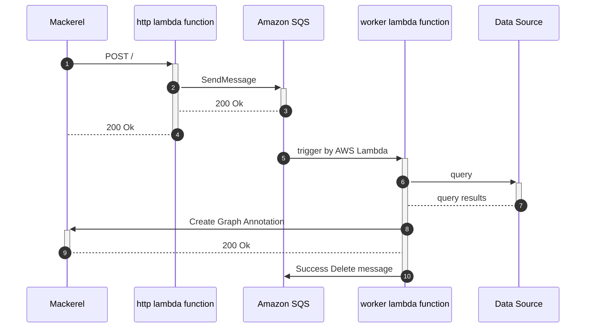

# redshift-data-set-annotator


[](https://github.com/mashiike/redshift-data-set-annotator/blob/master/LICENSE)

Annotator for QuickSight datasets with Redshift as the data source

The `redshift-data-set-annotator` is a tool to add dataset annotations based on column names, column comments, etc. for QuickSight datasets based on a single redshift Relation (table, view, etc.).

## Install 

#### Homebrew (macOS and Linux)

```console
$ brew install mashiike/tap/redshift-data-set-annotator
```

### Binary packages

[Releases](https://github.com/mashiike/redshift-data-set-annotator/releases)

## QuickStart 

1st configure for provisoned cluster
```shell
$ redshift-data-set-annotator configure                                                                                          
default profile is serverless?: (yes/no) [no]: no
Enter cluster identifier: warehouse
Enter db user: admin 
```

and execute annotate
```shell
$ redshift-data-set-annotator annotate --data-set-id <data-set-id>j
```

## Usage 

```
Usage: redshift-data-set-annotator <command>

Flags:
  -h, --help                     Show context-sensitive help.
      --aws-account-id=STRING    QuickSight aws account id
  -r, --region=STRING            AWS region ($AWS_REGION)
      --log-level="info"         output log level ($LOG_LEVEL)

Commands:
  configure
    Create a configuration file of redshift-data-set-annotator

  annotate --data-set-id=STRING
    Annotate a QuickSight dataset with Redshift as the data source

  version
    Show version

Run "redshift-data-set-annotator <command> --help" for more information on a command.
```

```
Usage: redshift-data-set-annotator annotate --data-set-id=STRING

Annotate a QuickSight dataset with Redshift as the data source

Flags:
  -h, --help                        Show context-sensitive help.
      --aws-account-id=STRING       QuickSight aws account id
  -r, --region=STRING               AWS region ($AWS_REGION)
      --log-level="info"            output log level ($LOG_LEVEL)

      --data-set-id=STRING          task ID
      --dry-run                     if true, no update data set and display plan
      --force-rename                The default is to keep any renaming that has already taken place. Enabling this option forces a name overwrite.
      --force-update-description    The default is to keep any renaming that has already taken place. Enabling this option forces a description overwrite.
```

## Configurations

Configuration file is HCL (HashiCorp Configuration Language) format. `redshift-data-set-annotator init` can generate a initial configuration file.

The most small configuration file is as follows:
```hcl
redshift-data-set-annotator {
    required_version = ">=v0.2.0"
    sqs_queue_name   = "redshift-data-set-annotator"
    service          = "prod"
}

rule "any_alert" {
    alert {
        any = true
    }

    information = <<EOF
How do you respond to alerts?
Describe information about your alert response here.
(This area can use Go's template notation.)
EOF
}
```

For more advanced configuration, please see [docs directory](docs/) 

## Usage with AWS Lambda (serverless)

redshift-data-set-annotator works with AWS Lambda and Amazon SQS.

Lambda Function requires a webhook and a worker





Let's solidify the Lambda package with the following zip arcive (runtime `provided.al2`)

```
lambda.zip
├── bootstrap    # build binary
└── config.hcl   # configuration file
```

A related document is [https://docs.aws.amazon.com/lambda/latest/dg/runtimes-custom.html](https://docs.aws.amazon.com/lambda/latest/dg/runtimes-custom.html)

for example.

deploy two lambda functions, redshift-data-set-annotator-http and redshift-data-set-annotator-worker in [lambda directory](lambda/)  
The example of lambda directory uses [lambroll](https://github.com/fujiwara/lambroll) for deployment.

For more information on the infrastructure around lambda functions, please refer to [example.tf](lambda/example.tf).

## LICENSE

MIT License

Copyright (c) 2022 IKEDA Masashi
